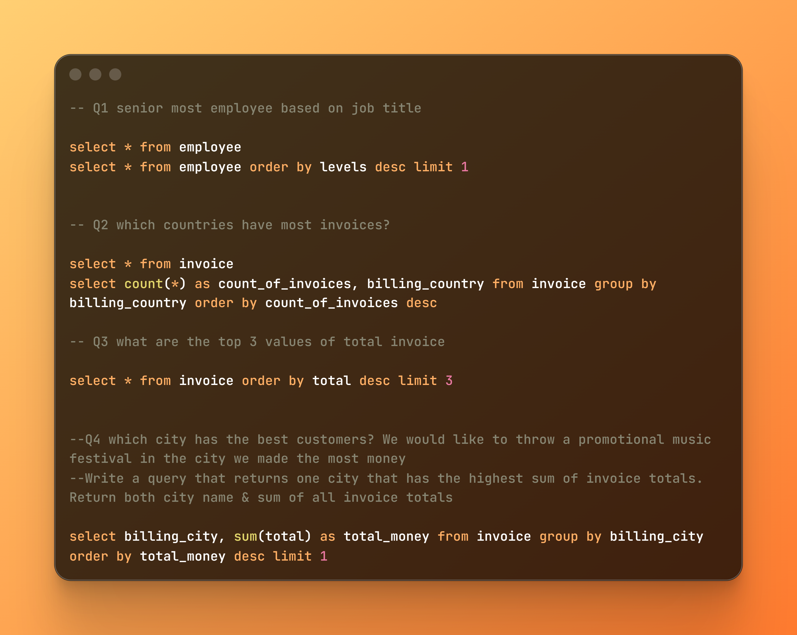

# Song-Database-SQL-Project

# Digital Song Store Analysis

An end-to-end data analytics project using PostgreSQL to query and analyze customer transactional data, employee structures, and international checkout patterns. This project focuses on converting raw relational tables into strategic, data-backed operational business intelligence.

## 📁 Repository Structure
* `Song_Store_database.sql`: The main database schema configuration and script tracking containing raw organizational logs.
* `images/songdata1.png`: Workflow execution screenshot tracking core transactional queries.

## 🛠️ Tech Stack
* **Database Management System:** PostgreSQL
* **Interface Tool:** pgAdmin 4

---

## 🔬 Core Queries & Strategic Business Logic

To extract immediate operational value from the transaction system, I built out targeted analytical queries focusing on core corporate metrics:

1. **Organizational Hierarchy Mapping:** Querying employee data matrices by relative tenure and job levels (`levels`) to automatically isolate and identify the senior-most team members across the organization.
2. **Cross-Border Market Density:** Aggregating transactional invoice sheets using `COUNT(*)` grouped by geographical fields (`billing_country`) to track relative order volume weights and target dense distribution markets.
3. **High-Value Purchase Auditing:** Sorting total invoice values in descending order combined with a strict `LIMIT 3` window constraint to cleanly surface the company's absolute highest individual check-out numbers.
4. **Localized Promotional Targeting:** Consolidating regional billing data (`billing_city`) against financial metrics like `SUM(total)` to discover the single highest revenue-generating city in the entire log.
5. **Top Consumer Profiling (Customer Lifetime Value):** Constructing a multi-table `JOIN` query connecting the `customer` and `invoice` tables on shared relational keys, aggregating absolute expenditures using `SUM(total)`, and applying a descending filter to capture the single highest-value buyer.

### 📊 Query Script Reference
The execution and validation of these business questions are logged in the pgAdmin script below:

---

## 🧠 Core Business Insights Unlocked

* **Command Transparency:** Querying administrative structural tables provides immediate organizational visibility, clarifying management paths based on tracking data rather than manual rosters.
* **Logistical Prioritization:** Analyzing order frequencies across national borders highlights major target markets, indicating exactly where customer baseline volume remains dominant for logistics or distribution scale adjustments.
* **Targeted Spend Optimization:** Running aggregate localization scripts strips the guesswork out of marketing budgets. By identifying the exact city generating the highest baseline financial footprint, the company can confidently fund and deploy physical initiatives—like local music festivals—directly into high-conversion hot spots.
* **Customer Lifetime Value (CLV) Maximization:** Slicing through granular consumer profiles highlights the store's single most valuable customer. Isolating this high-spending tier gives management a clear framework for executing personalized customer relationship management (CRM) strategies, VIP loyalty systems, and high-tier retention campaigns.

